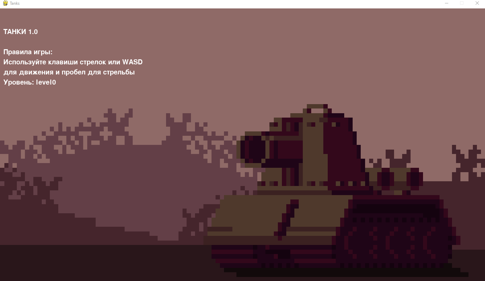
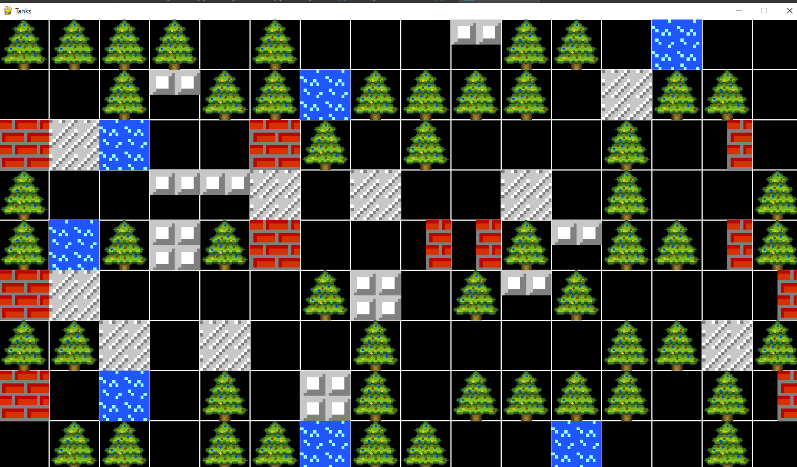

# Galaga_pygame_project

собрано с помощью pyinstaller --icon=images/main.ico --onefile --noconsole main.py

### Проект представляет из себя игровую консоль с несколькими играми

### 1)Тачики, правила:
~~~~
1. Для запуска игра необходимо при помощи колесика мыши или клавиш стрелок выбрать игру
2. Далее надать Enter
3. Откроется окно с выбором уровня и заставкой
4. Уровень выбирается стрелками влево, вправо и нажатием Enter
5. Запускается игра, для движения клавиши WASD и стрелки
6. Для стрельбы используйте пробел
7. Комбинация клавишь ctrl + N открывает окно с созданием уровня
8. Чтобы поставить стенку необходимо крутить колесико мыши
9. Нажатие на клетку ставит туда блок
10. ctrl + S чтобы сохранить уровень
11. Бонусы помогают тграть
12. Задача - убить все вражеские танки(счетчик в правом верхнем углу)
13. УДАЧИ!
~~~~

